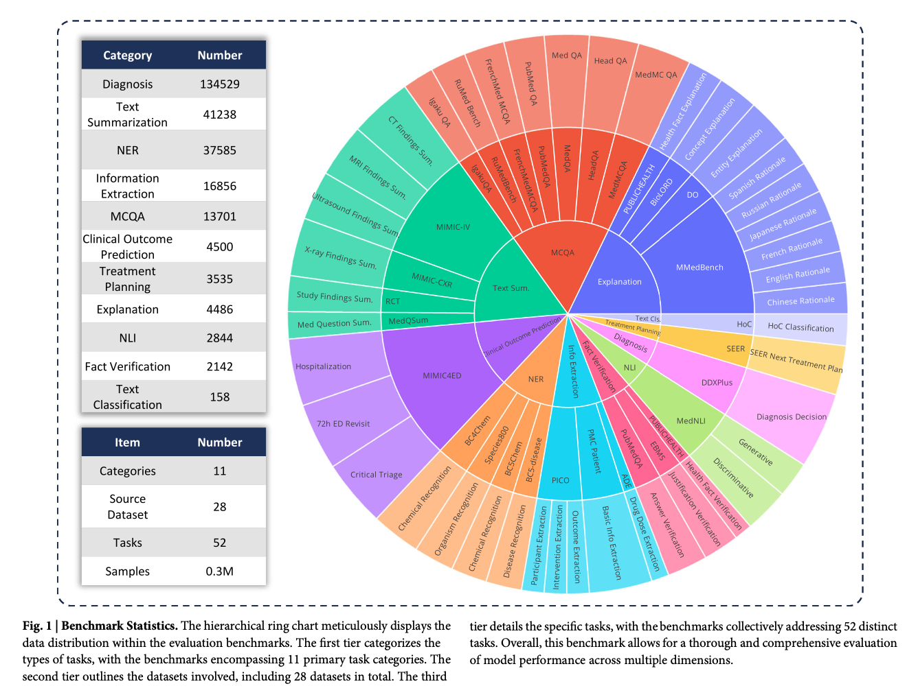
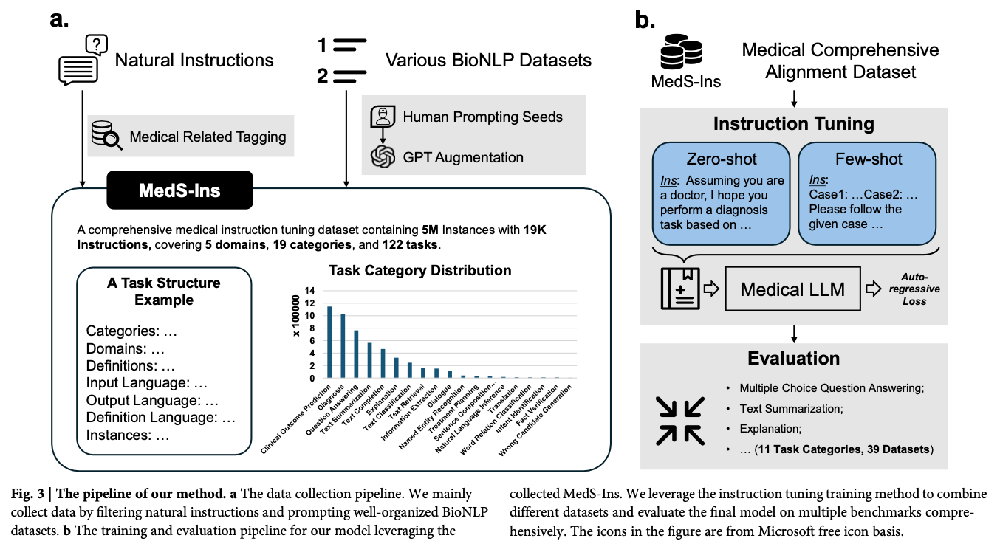

# MMedIns-Llama 3

**Paper:** [Towards evaluating and building versatile large language models for medicine](https://www.nature.com/articles/s41746-024-01390-4)

## 1. Overview

MMedIns-Llama 3은 **MedS-Ins 데이터셋** (5M 인스턴스, 19K 인스트럭션, 122개 태스크)을 활용하여 개발된 **의료 도메인 특화 언어 모델**입니다.

## 2. Datasets


*Figure 1: MedS-Benchmark의 계층적 구조. 가장 바깥쪽 원은 11개의 주요 task categories를 나타내며, 중간 원은 28개의 소스 데이터셋, 가장 안쪽 원은 52개의 세부 태스크를 보여준다.*


### 2.1 Source Datasets
- **규모**: 58개의 의료 관련 데이터셋
- **예시**: MIMIC-IV, MedQA, SEER 등
- **활용**: MedS-Bench와 MedS-Ins 구축을 위한 기본 소스

### 2.2 MedS-Bench (벤치마크 데이터셋)
- **목적**: 의료 LLM 모델들의 성능을 평가하기 위한 벤치마크
- **구성**: 
 - 28개의 데이터셋 선택
 - 11개 clinical tasks로 재구성
 - instruction-prompted Q&A 구조로 변환
- **규모**: 약 0.3M 샘플
- **특징**: 실제 임상 상황을 반영한 종합적 평가 가능

### 2.3 MedS-Ins (학습용)
- **목적**: 의료 LLM을 학습시키기 위한 instruction tuning 데이터셋
- **구성**: 
 - 58개 데이터셋 + Natural Instructions
 - 19개 task categories
 - 122개 세부 태스크
- **규모**: 
 - 5M 인스턴스
 - 19K 인스트럭션
- **도메인 분포**:
 - Medical knowledge bases (43%)
 - Clinical texts (35%)
 - Academic papers (13%)
 - Exams (7%)
 - Daily conversations (2%)


### 2.4 데이터셋 관계도

             Source Datasets (58개)
                     |
            ________ | ________
           |                   |
           ↓                   ↓
    MedS-Bench (28개)    MedS-Ins (58개+α)
    (평가 데이터셋)       (학습 데이터셋)
           |                   |
           ↓                   ↓
     벤치마크 구축      MMedIns-Llama 3 학습
           |                   |
           |_______   ________|
                   | |
                   ↓
                  평가

**주요 특징**:
- MedS-Bench와 MedS-Ins는 각각 벤치마크 구축과 Instruction-Tuning이라는 다른 목적으로 최적화
- MedS-Ins는 Natural Instructions에서 필터링한 추가 데이터 포함

## 3. Task Categories of MedS-InS

MedS-Ins는 MedS-Bench의 11개 평가 카테고리를 포함하여, 총 19개의 task categories를 4개의 주요 그룹으로 분류한다.

<br>

| Category | Tasks |
| :---------------------------- | :------------------------------------------------------------------------------------------------------------------------------------------------------------------------------------------------ |
| **Clinical Decision Support** | Diagnosis<br>Treatment Planning<br>Clinical Outcome Prediction<br>Information Extraction |
| **Medical Text Processing** | Text Summarization<br>Named Entity Recognition<br>Text Classification<br>Text Retrieval |
| **Medical Knowledge Understanding** | Multiple Choice Question Answering<br>Explanation<br>Rationale<br>Fact Verification<br>Natural Language Inference |
| **Medical Communication** | Intent Identification<br>Translation<br>Dialogue<br>Sentence Composition Analysis<br>Word Relation Classification<br>Wrong Candidate Generation |

<br>

---

## 3. Insturction-tuning training Data Sources




### 3.1 Data Distribution

-   **Medical knowledge bases (43%)**: 의학 사전, 지식 그래프 등
-   **Clinical texts (35%)**: 진료 기록, 방사선 리포트 등
-   **Academic papers (13%)**: 의학 연구 논문
-   **Exams (7%)**: 의료 시험 문제
-   **Daily conversations (2%)**: 의사-환자 상담 기록

---

## 4. Model Architecture & Training

### 4.1 Base Model

-   **MMed-Llama 3** (다국어 의료 LLM)

### 4.2 Training Configuration

-   **Sequence Length**: 2048 토큰
-   **Batch Size**: 128
-   **Learning Rate**: 1e-5
-   **Hardware**: 32 Ascend910B GPUs
-   **Training Duration**: 383.5시간
-   **Epochs**: 5
-   **Precision**: BF16
-   **Optimization**: Gradient checkpointing
-   **Distribution**: FSDP (Fully Sharded Data Parallel)

---

## 5. Training Methodology

### 5.1 Data Construction Process (MedS-InS)


#### A. Filtering Natural Instructions

-   **기존 Instruction 데이터 필터링**
    -   Super-NaturalInstructions에서 의료 관련 1,616개 태스크 필터링
    -   Healthcare, Medicine 카테고리 데이터 추출
    -   LIMA, ShareGPT 등에서 의료 관련 데이터 필터링
-   **결과**
    -   37개 태스크
    -   75,373개 샘플 수집

#### B. Prompting Existing BioNLP Dataset

-   **데이터 수집**
    -   MIMIC-IV-Note와 같은 기존 의료 데이터셋 활용
    -   구조화된 의료 리포트, 진단 기록 등 수집
    -   85개의 추가 태스크 통합

-   **프롬프트 생성**
    -   각 태스크당 5명의 전문가가 3개씩 프롬프트 작성 (태스크당 15개)
    -   전문가가 생성한 프롬프트를 기반으로 GPT-4를 활용한 프롬프트 추가 생성
    -   예시:

        ```
        [원본 데이터]
        Findings: 상세 초음파 소견
        Impression: 요약된 결론

        [변환된 프롬프트]
        Instruction: Given the detailed finding of Ultrasound imaging diagnostics,
                    summarize the note's conclusion in a few words.
        Input: [Findings 내용]
        Output: [Impression 내용]
        ```

-   **데이터 구조화**
    -   **Categories**: 태스크 카테고리 분류
    -   **Domains**: 텍스트 도메인 정의
    -   **Definitions**: 태스크 설명
    -   **Input/Output/Definition Language**: 언어 명시
    -   **Instances**: 훈련/평가용 데이터 쌍

#### C. 최종 데이터셋 구성

-   **규모**
    -   5M 인스턴스
    -   19K 인스트럭션
    -   122개 태스크 (37 + 85)
-   **도메인 분포**
    -   Medical knowledge bases (43%)
    -   Clinical texts (35%)
    -   Academic papers (13%)
    -   Exams (7%)
    -   Daily conversations (2%)

---


### 5.2 Prompting Strategy & Training Process

1. **Training Process**
   - Autoregressive한 next token prediction
   - Cross-entropy loss 사용
   - Input Format: [인스트럭션 토큰들] [컨텍스트 토큰들] [정답 토큰들]

2. **프롬프팅 전략**
   
   A. **Zero-shot Approach**
   ```plaintext
   Instruction: Given the detailed finding of Ultrasound imaging diagnostics,
               summarize the note's conclusion in a few words.
   Input: [환자의 초음파 findings 내용]
   Output: [impression 섹션의 내용]
   ```

   B. **Few-shot Approach**
   ```plaintext
   Case 1: [예시 케이스 1]
   Case 2: [예시 케이스 2]
   Case 3: [예시 케이스 3]
   Instruction: Follow the examples above...
   Input: [새로운 케이스]
   ```
### 5.3 Evaluation Metrics

#### Accuracy 기반 평가

-   **Multiple-choice QA** (MedQA, MedMCQA)
-   **Diagnosis** (DDXPlus)
-   **Treatment Planning** (SEER)
-   **Clinical Outcome Prediction** (MIMIC4ED)

#### Precision, Recall, F1 Score

-   **Named Entity Recognition**
    -   Chemical Recognition (BC4Chem, BC5Chem)
    -   Disease Recognition (BC5Disease)
    -   Organism Recognition (Species800)
-   **Text Classification** (HoC)

#### BLEU/ROUGE Score

-   **Text Summarization**
    -   Medical Reports (MedQSum)
    -   Clinical Notes (MIMIC-IV)
    -   Radiology Reports (MIMIC-CXR)
-   **Concept Explanation** (BioLORD)
-   **Rationale Generation** (MMedBench)

---
